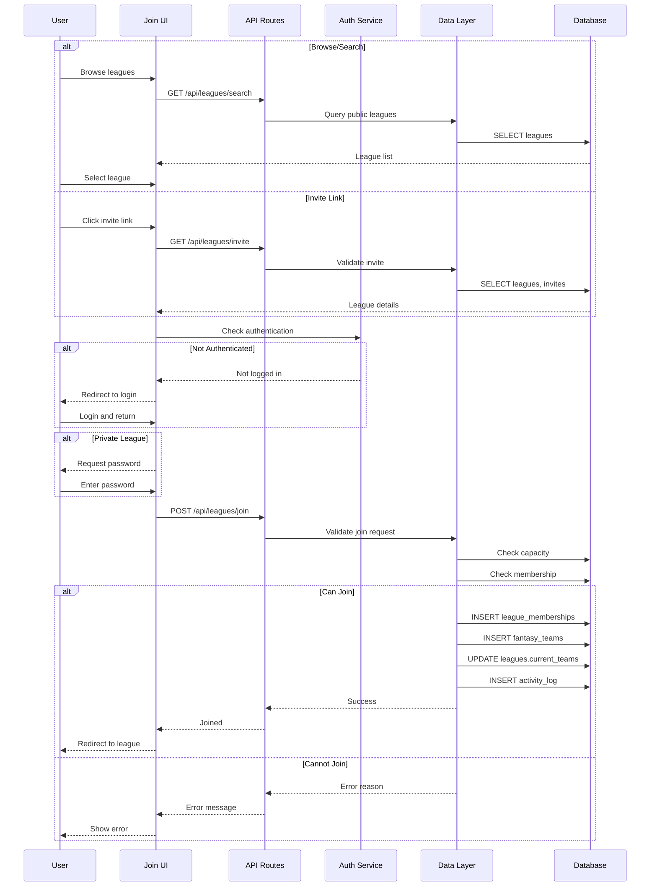

# Join League Flow

## Overview
League joining flow with multiple entry points: browse, search, and invite links.

## Related Files
- `/app/api/leagues/join/route.ts` - Join league API
- `/app/api/leagues/search/route.ts` - Search leagues API
- `/app/(dashboard)/league/join/page.tsx` - Join league UI
- `/app/invite/[leagueId]/page.tsx` - Invite link handler
- `/lib/db/leagues.ts` - League DAL
- `/lib/db/league_memberships.ts` - Membership DAL

## User Flow
```mermaid
flowchart TB
  classDef user fill:#fef3c7,stroke:#f59e0b,stroke-width:2,color:#92400e
  classDef search fill:#e0e7ff,stroke:#6366f1,stroke-width:2,color:#312e81
  classDef validate fill:#fee2e2,stroke:#ef4444,stroke-width:2,color:#7f1d1d
  classDef api fill:#fce7f3,stroke:#ec4899,stroke-width:2,color:#831843
  classDef db fill:#d1fae5,stroke:#10b981,stroke-width:2,color:#064e3b
  
  Start([User wants to join]):::user
  
  subgraph Entry Points
    Browse[Browse Public]:::search
    Search[Search by Name]:::search
    Invite[Invite Link]:::search
  end
  
  LeagueList[League List]:::search
  SelectLeague[Select League]:::user
  
  CheckAuth{Authenticated?}:::validate
  Login[Redirect to Login]:::user
  
  CheckPrivate{Private League?}:::validate
  PasswordModal[Enter Password]:::user
  
  CheckCapacity{Has Space?}:::validate
  ShowFull[League Full Error]:::validate
  
  CheckMember{Already Member?}:::validate
  ShowMember[Already Joined]:::validate
  
  JoinAPI[POST /api/leagues/join]:::api
  
  CreateMembership[Create Membership]:::db
  CreateTeam[Create Fantasy Team]:::db
  UpdateCount[Update League Count]:::db
  LogActivity[Log Join Event]:::db
  
  Success[League Dashboard]:::user
  
  Start --> Entry Points
  Browse --> LeagueList
  Search --> LeagueList
  Invite --> CheckAuth
  
  LeagueList --> SelectLeague
  SelectLeague --> CheckAuth
  
  CheckAuth -->|No| Login
  CheckAuth -->|Yes| CheckPrivate
  Login --> CheckPrivate
  
  CheckPrivate -->|Yes| PasswordModal
  CheckPrivate -->|No| CheckCapacity
  PasswordModal --> CheckCapacity
  
  CheckCapacity -->|Full| ShowFull
  CheckCapacity -->|Space| CheckMember
  
  CheckMember -->|Yes| ShowMember
  CheckMember -->|No| JoinAPI
  
  JoinAPI --> CreateMembership
  CreateMembership --> CreateTeam
  CreateTeam --> UpdateCount
  UpdateCount --> LogActivity
  LogActivity --> Success
```

## Sequence Diagram


## Data Interactions

| Collection | Operation | Attributes | Notes |
|------------|-----------|------------|-------|
| `leagues` | READ | `$id`, `name`, `is_public`, `current_teams`, `max_teams` | Find joinable leagues |
| `leagues` | UPDATE | `current_teams` | Increment member count |
| `invites` | READ | `invite_code`, `league_id`, `expires_at` | Validate invite links |
| `invites` | UPDATE | `uses`, `accepted_at` | Track invite usage |
| `league_memberships` | READ | `league_id`, `client_id` | Check existing membership |
| `league_memberships` | CREATE | `league_id`, `client_id`, `role=member`, `status=active` | Add new member |
| `fantasy_teams` | CREATE | `league_id`, `owner_client_id`, `name` | Create user's team |
| `activity_log` | CREATE | `action=league_joined`, `league_id`, `client_id` | Track join event |

## Validation Rules

### Join Requirements
- User must be authenticated
- League must have space (current_teams < max_teams)
- User cannot already be a member
- Private leagues require valid password or invite
- League must be in "open" or "drafting" status
- Invite must not be expired

## Error States
- `401` - User not authenticated
- `403` - Wrong password / Invalid invite
- `404` - League not found
- `409` - Already a member / League full
- `410` - League closed / Draft completed
