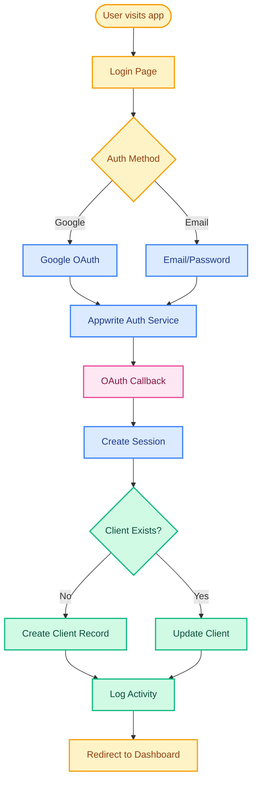

# Create Account Flow

## Overview
User account creation flow using Appwrite Auth with Google OAuth and email/password options.

## Related Files
- `/app/api/auth/callback/route.ts` - OAuth callback handler
- `/app/(auth)/login/page.tsx` - Login/signup UI
- `/lib/appwrite-server.ts` - Server-side Appwrite client
- `/lib/db/clients.ts` - Client DAL

## User Flow

## Sequence Diagram

## Data Interactions

| Collection | Operation | Attributes Set | Notes |
|------------|-----------|---------------|-------|
| `clients` | READ | `auth_user_id` | Check if client exists |
| `clients` | CREATE | `auth_user_id`, `display_name`, `email`, `avatar_url`, `created_at` | New user registration |
| `clients` | UPDATE | `last_login` | Existing user login |
| `activity_log` | CREATE | `action`, `client_id`, `metadata`, `created_at` | Track signup/login events |
| `leagues` | READ | - | Load user leagues after login |
| `league_memberships` | READ | `client_id` | Find user memberships |

## Validation & Error States

### Zod Schemas
- `clientsSchema` - Validates client data structure
- Email validation in auth forms

### Error Handling
- OAuth failure → Show error, redirect to login
- Email already exists → Prompt to login instead
- Weak password → Show requirements
- Network error → Retry with backoff
- Session expired → Re-authenticate
