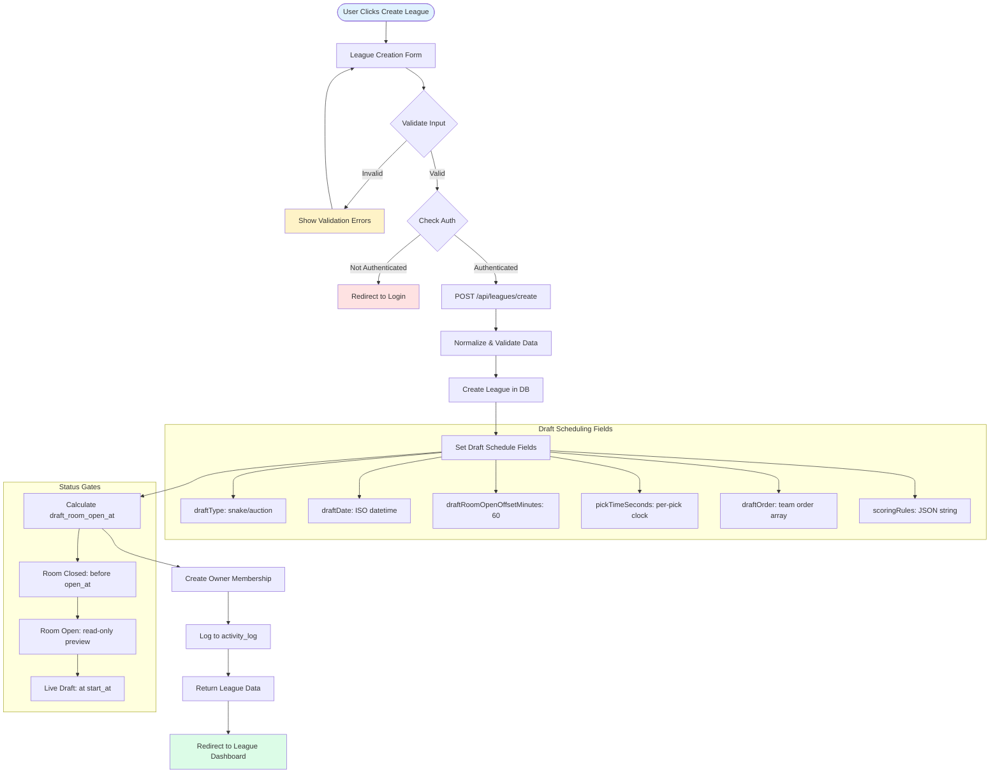
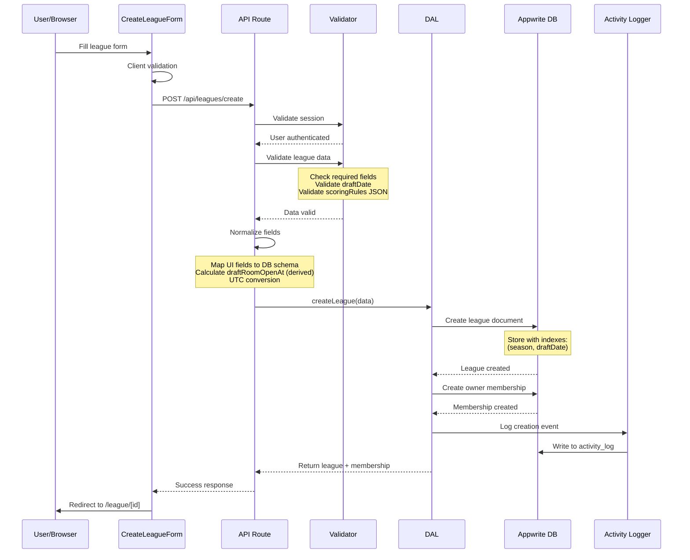

# Create League Flow (with Draft Scheduling)

## Overview
Complete flow for creating a new fantasy football league, including draft scheduling and configuration.

## Auth Route Handlers Detected
- `/api/leagues/create` - Main league creation endpoint
- Appwrite Account endpoint via cookie for session validation
- Validation handled in-route; no separate `/api/leagues/validate`

## 1. Flowchart



## 2. Sequence Diagram



## 3. Data Interaction Table

| Collection | Operation | Attributes Set | Notes |
|------------|-----------|----------------|-------|
| leagues | WRITE | leagueName, draftType, pickTimeSeconds, scoringRules, draftDate, commissionerAuthUserId, isPublic, season, selectedConference (if mode=conference) | Primary league creation with scheduling |
| league_memberships | WRITE | leagueId, authUserId (commissioner), role='COMMISSIONER', status='ACTIVE', joinedAt | Auto-create owner membership |
| activity_log | WRITE | actorClientId/authUserId, action='league.create', objectType='league', objectId, payloadJson, ts | Audit trail for league creation |

## 4. Validation Rules (Zod Schema)

```typescript
const createLeagueSchema = z.object({
  leagueName: z.string().min(3).max(50),
  type: z.enum(['public', 'private']),
  maxTeams: z.number().min(4).max(24),
  scoringRules: z.string(),
  
  // Draft scheduling (required for real leagues)
  draftType: z.enum(['snake', 'auction']),
  draftDate: z.string().datetime(),
  draftRoomOpenOffsetMinutes: z.number().default(60),
  pickTimeSeconds: z.number().min(30).max(600),
  draftOrder: z.array(z.string()).optional(), // Generated if not provided
  
  // Optional fields
  password: z.string().optional(),
  selectedConference: z.enum(['SEC', 'ACC', 'Big 12', 'Big Ten']).optional()
})
```

## 5. Error States

- **Validation Errors**: Invalid form data, missing required fields
- **Authentication Errors**: User not logged in or session expired
- **Duplicate League Name**: League with same name already exists for user
- **Invalid Draft Time**: Draft scheduled in the past or conflicting with existing drafts
- **Database Errors**: Appwrite connection issues or write failures
- **Rate Limiting**: Too many leagues created in short timeframe

## 6. Server-Side Calculations

```typescript
// Calculate draft room open time (server-side in UTC)
const draftRoomOpenAt = new Date(
  new Date(draftDate).getTime() - 
  (draftRoomOpenOffsetMinutes * 60 * 1000)
).toISOString()

// Store timezone if available for display purposes
const timezone = Intl.DateTimeFormat().resolvedOptions().timeZone
```

## 7. Index Recommendations

- **(season, draftDate)** - For querying upcoming drafts by season
- **(commissionerAuthUserId, createdAt)** - For user's leagues list
- **(type, leagueStatus, draftDate)** - For public league discovery
- **(inviteCode)** - Unique index for invite links

Notes:
- Immutable after creation: gameMode and selectedConference

See also:
- docs/diagrams/project-map/overview/leagues.md