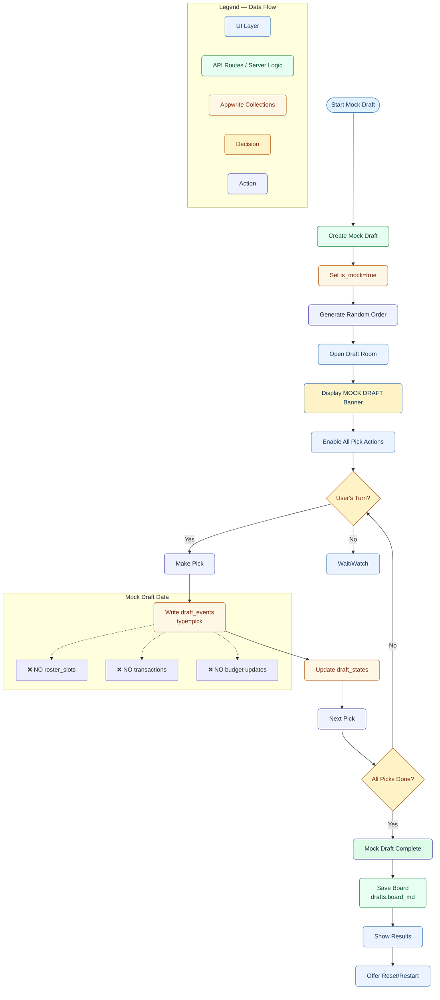

# Draft System Flow (Mock vs Real, Scheduled)

## Overview
Comprehensive draft system supporting both mock drafts (practice) and real drafts (scheduled, season commits) with timing gates and room access control.


## API Endpoints
- `GET /api/drafts/:id/room-state` - Check room access and timing
- `POST /api/drafts/mock/create` - Create mock draft
- `POST /api/drafts/create` - Create real draft
- `POST /api/drafts/:id/pick` - Make a pick
- `GET /api/drafts/:id/events` - Get draft events stream
- `WebSocket /api/drafts/:id/live` - Real-time updates

## A) Mock Draft Flow (No Season Commits)



## B) Real Draft Flow (Scheduled, Season Commits)


## C) Shared UI & Timing Control


## 4. Data Interaction Comparison

| Collection | Mock Draft | Real Draft | Notes |
|------------|------------|------------|-------|
| drafts | READ/WRITE | READ/WRITE | is_mock flag differentiates |
| draft_states | WRITE | WRITE | Current pick state |
| draft_events | WRITE | WRITE | All pick events |
| roster_slots | ❌ NO | ✅ WRITE | Only real drafts commit |
| transactions | ❌ NO | ✅ WRITE | Only real drafts record |
| fantasy_teams | ❌ NO | ✅ UPDATE | Budget only for auction |
| activity_log | WRITE | WRITE | Both log activity |

## 5. Room State API Response

```typescript
interface RoomStateResponse {
  now: string // Server time ISO
  draft_start_at: string
  draft_room_open_at: string
  isOpen: boolean // Can enter room
  isLive: boolean // Can make picks
  isComplete: boolean
  server_tz: string // Server timezone
  timeToOpen?: number // Milliseconds
  timeToStart?: number // Milliseconds
}

// GET /api/drafts/:id/room-state
async function getRoomState(draftId: string) {
  const draft = await getDraft(draftId)
  const now = new Date()
  
  return {
    now: now.toISOString(),
    draft_start_at: draft.draft_start_at,
    draft_room_open_at: draft.draft_room_open_at,
    isOpen: now >= new Date(draft.draft_room_open_at),
    isLive: now >= new Date(draft.draft_start_at),
    isComplete: draft.status === 'completed',
    server_tz: Intl.DateTimeFormat().resolvedOptions().timeZone,
    timeToOpen: Math.max(0, new Date(draft.draft_room_open_at) - now),
    timeToStart: Math.max(0, new Date(draft.draft_start_at) - now)
  }
}
```

## 6. Pick Validation Middleware

```typescript
// Middleware to enforce timing gates
async function validatePickTiming(req: Request) {
  const { draftId } = req.params
  const roomState = await getRoomState(draftId)
  
  if (!roomState.isLive && !draft.is_mock) {
    throw new Error('Draft has not started yet')
  }
  
  if (roomState.isComplete) {
    throw new Error('Draft is already complete')
  }
  
  // Check if it's user's turn
  const currentPick = await getCurrentPick(draftId)
  if (currentPick.team_id !== req.user.team_id) {
    throw new Error('Not your turn to pick')
  }
  
  return true
}
```

## 7. Draft Board Generation

```typescript
// Generate Mermaid board after draft completion
async function generateDraftBoard(draftId: string) {
  const events = await getDraftEvents(draftId)
  const picks = events.filter(e => e.type === 'pick')
  
  let mermaid = `graph TD\n`
  mermaid += `  subgraph "Draft Results"\n`
  
  picks.forEach((pick, i) => {
    const round = Math.floor(i / 12) + 1
    const pickInRound = (i % 12) + 1
    mermaid += `    Pick${i}["R${round}P${pickInRound}: ${pick.player_name}\\n${pick.team_name}"]`
    
    if (i > 0) {
      mermaid += ` --> Pick${i + 1}`
    }
    mermaid += '\n'
  })
  
  mermaid += `  end\n`
  
  // Save to file
  const filename = `${draftId}-${new Date().getFullYear()}.md`
  const path = `docs/diagrams/draft-boards/${filename}`
  await saveFile(path, mermaid)
  
  // Update draft record
  await updateDraft(draftId, { board_asset_uri: path })
  
  return path
}
```

## 8. Required Indexes

- **draft_events**: `(draft_id, overall)` - For ordered pick retrieval
- **draft_states**: `(draft_id)` unique - Current state lookup
- **drafts**: `(league_id, season)` - League's drafts
- **leagues**: `(season, draft_start_at)` - Upcoming drafts query

## 9. Testing Requirements

```typescript
describe('Draft Room Timing Gates', () => {
  it('should deny access before room opens', async () => {
    const draft = createDraft({
      draft_start_at: addHours(now, 2),
      draft_room_open_offset_minutes: 60
    })
    
    const state = await getRoomState(draft.id)
    expect(state.isOpen).toBe(false)
    expect(state.isLive).toBe(false)
  })
  
  it('should allow read-only access when room opens', async () => {
    const draft = createDraft({
      draft_start_at: addMinutes(now, 30),
      draft_room_open_offset_minutes: 60
    })
    
    const state = await getRoomState(draft.id)
    expect(state.isOpen).toBe(true)
    expect(state.isLive).toBe(false)
  })
  
  it('should enable picks at draft start time', async () => {
    const draft = createDraft({
      draft_start_at: now,
      draft_room_open_offset_minutes: 60
    })
    
    const state = await getRoomState(draft.id)
    expect(state.isOpen).toBe(true)
    expect(state.isLive).toBe(true)
  })
})
```