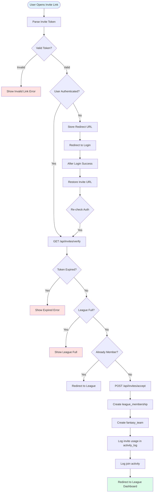
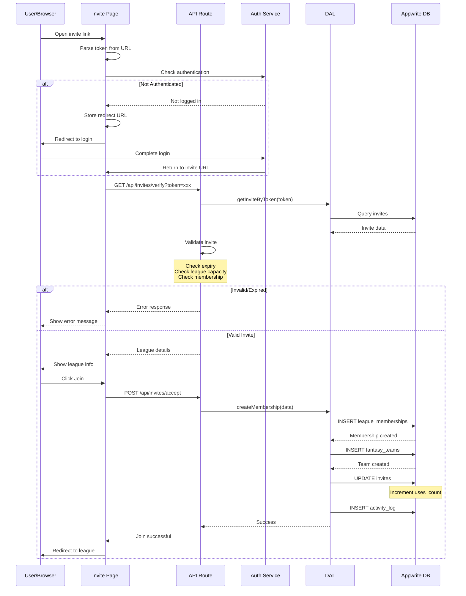

# Join League Flow (Invite)

## Overview
Complete flow for joining a fantasy league via invite link or browse.

## Auth Route Handlers Detected
- `/app/(dashboard)/api/leagues/invite` - Validate invite token or get invite links
- `/app/(dashboard)/api/leagues/join` - Direct join endpoint
- `/app/(dashboard)/api/leagues/search` - Browse public leagues

## 1. Flowchart



## 2. Sequence Diagram



## 3. Data Interaction Table

| Collection | Operation | Attributes Read/Written | Notes |
|------------|-----------|------------------------|-------|
| activity_log | READ | type='league_invite', leagueId, inviteToken, status, expiresAt | Validate invite |
| activity_log | UPDATE/CREATE | status or new log row | Track invite usage |
| leagues | READ | $id, maxTeams, currentTeams, status | Check capacity |
| league_memberships | READ | leagueId, authUserId | Check existing membership |
| league_memberships | WRITE | leagueId, authUserId, role='MEMBER', status='ACTIVE', joinedAt | Create new membership |
| fantasy_teams | WRITE | leagueId, ownerAuthUserId, name, createdAt | Create user's team for visibility |

## 4. Validation Steps

```typescript
// Invite validation logic
async function validateInvite(token: string) {
  const invite = await getInviteByToken(token)
  
  if (!invite) {
    throw new Error('Invalid invite link')
  }
  
  if (invite.expires_at && new Date(invite.expires_at) < new Date()) {
    throw new Error('Invite link has expired')
  }
  
  if (invite.max_uses && invite.uses_count >= invite.max_uses) {
    throw new Error('Invite link has reached maximum uses')
  }
  
  const league = await getLeague(invite.league_id)
  
  if (league.current_teams >= league.max_teams) {
    throw new Error('League is full')
  }
  
  const membership = await checkMembership(league.id, userId)
  
  if (membership) {
    throw new Error('Already a member of this league')
  }
  
  return { invite, league }
}
```

## 5. Error States

- **Invalid Token**: Token doesn't exist or malformed
- **Expired Invite**: Invite past expiration date
- **Max Uses Reached**: Invite used maximum times
- **League Full**: League at capacity
- **Already Member**: User already in league
- **Not Authenticated**: User needs to log in first
- **Database Error**: Connection or write failures

## 6. Authentication Flow

```typescript
// Store redirect for post-login
if (!authenticated) {
  sessionStorage.setItem('redirect_after_login', window.location.href)
  router.push('/login')
}

// After successful login
const redirect = sessionStorage.getItem('redirect_after_login')
if (redirect) {
  sessionStorage.removeItem('redirect_after_login')
  router.push(redirect)
}
```

## 7. Alternative Join Methods

### Browse Public Leagues
- User can browse `/leagues/browse`
- Filter by conference, draft type, open spots
- Direct join without invite for public leagues

### Direct League ID
- Share league ID directly
- Join via `/league/join?id=xxx`
- Requires password for private leagues