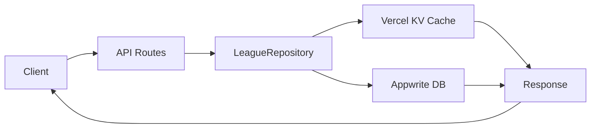

# League Management Flow

```mermaid
flowchart LR
    A[Client] --> B[API Routes]
    B --> C[LeagueRepository]
    C --> D[Vercel KV Cache]
    C --> E[Appwrite DB]
    D --> F[Response]
    E --> F
    F --> A
```
