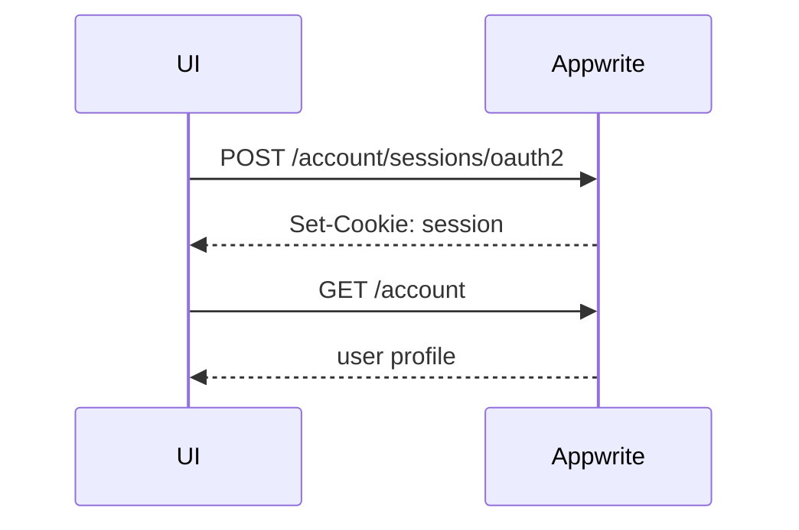

# Auth APIs & Events

- Login/Logout
- Session verification (Appwrite account via cookie)
- OAuth (Google) callback flow
- Events: session_created, session_expired

Related: ../overview/auth.md

```mermaid
sequenceDiagram
  participant UI
  participant APP as Appwrite

  UI->>APP: POST /account/sessions/oauth2
  APP-->>UI: Set-Cookie: session
  UI->>APP: GET /account
  APP-->>UI: user profile
```

