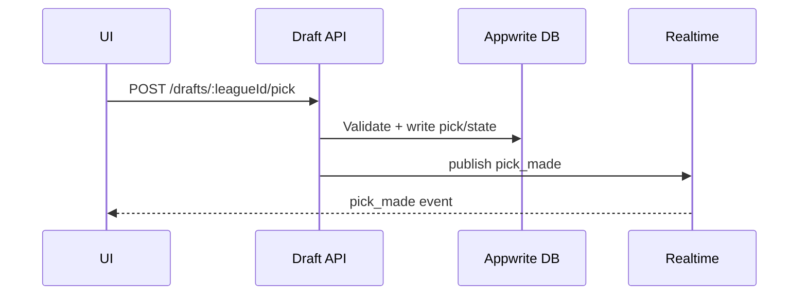

# Draft APIs & Events

APIs:
- Backend: /api/(backend)/drafts/[leagueId]/data, /start, cron/draft-autopick
- Frontend: /api/(frontend)/draft/players
- External: /api/(external)/cfbd/players

Events:
- pick_made, turn_changed, draft_started, draft_ended, autopick_triggered

Related: ../overview/draft.md

