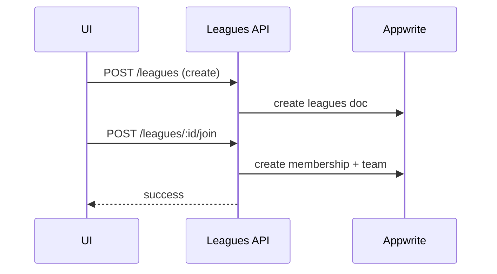

# Leagues APIs & Events

APIs:
- Create/update league, join/invite
- Read league data, members, teams

Events:
- membership_added, membership_removed
- league_updated (non-immutable)

Related: ../overview/leagues.md
 

