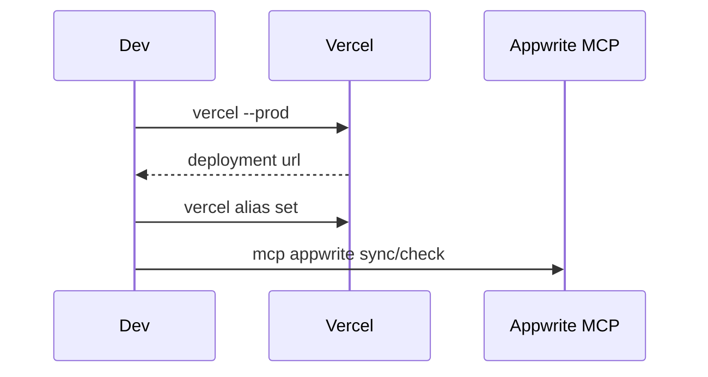

# Ops/Deploy APIs & Events

APIs/CLI:
- vercel, vercel logs, vercel alias
- Appwrite APIs via MCP server

Events:
- deployment_succeeded, deployment_failed

Related: ../overview/ops-deploy.md

```mermaid
sequenceDiagram
  participant Dev
  participant V as Vercel
  participant A as Appwrite MCP

  Dev->>V: vercel --prod
  V-->>Dev: deployment url
  Dev->>V: vercel alias set
  Dev->>A: mcp appwrite sync/check
```

