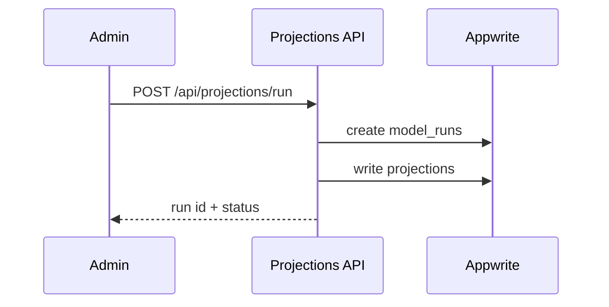

# Projections APIs & Events

APIs:
- POST /api/projections/run (admin)
- GET /api/(frontend)/draft/players (consume projections)

Events:
- projection_run_started, projection_run_finished

Related: ../overview/projections.md

