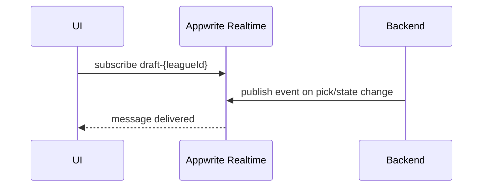

# Realtime APIs & Events

APIs:
- None (client connects directly to Appwrite Realtime)
- Backend emits events after DB changes

Events:
- Domain-specific (draft picks, scoring updates)

Related: ../overview/realtime.md

