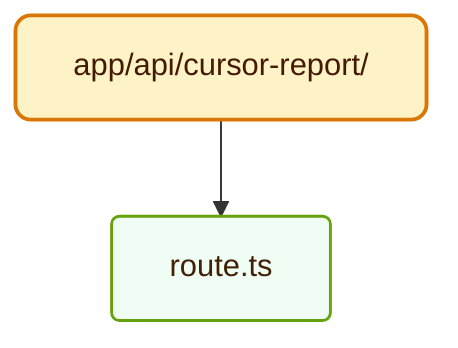

# Project Map — app/api/cursor-report

```mermaid
flowchart TB
  classDef folder fill:#fef3c7,stroke:#d97706,stroke-width:2,color:#451a03,rx:8,ry:8
  classDef file fill:#f0fdf4,stroke:#65a30d,stroke-width:1.5,color:#422006,rx:4,ry:4
  app_api_cursor_report["app/api/cursor-report/" ]
  class app_api_cursor_report folder
  app_api_cursor_report_route_ts["route.ts"]
  class app_api_cursor_report_route_ts file
  app_api_cursor_report --> app_api_cursor_report_route_ts
```
