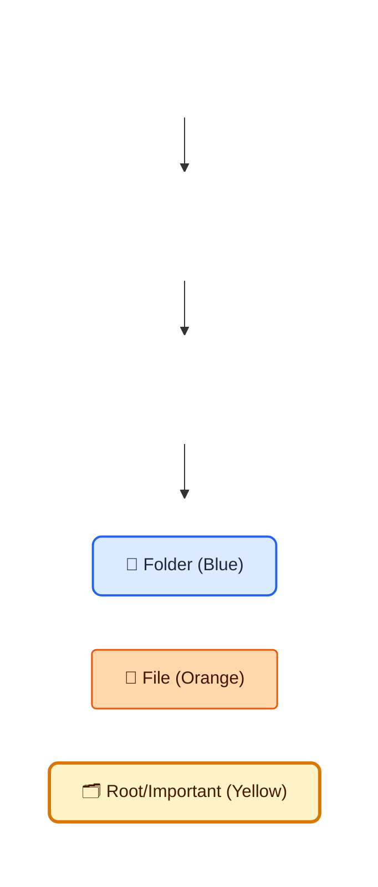

# Project Map — app/api

```mermaid
flowchart TB
  classDef folder fill:#dbeafe,stroke:#2563eb,stroke-width:2,color:#1e293b,rx:8,ry:8
  classDef file fill:#fed7aa,stroke:#ea580c,stroke-width:1.5,color:#431407,rx:4,ry:4
  classDef highlight fill:#fef3c7,stroke:#d97706,stroke-width:3,color:#451a03,rx:8,ry:8
  
  app_api["🗂️ app/api/<br/>Next.js API Routes"]
  class app_api highlight

  %% Route Groups
  backend_group["📁 (backend)/<br/>Internal APIs"]
  class backend_group folder
  app_api --> backend_group
  
  external_group["📁 (external)/<br/>3rd Party Integrations"]  
  class external_group folder
  app_api --> external_group
  
  frontend_group["📁 (frontend)/<br/>Client-facing APIs"]
  class frontend_group folder
  app_api --> frontend_group

  %% Standalone Routes
  auctions_route["📄 auctions/route.ts<br/>Auction management"]
  class auctions_route file
  app_api --> auctions_route
  
  bids_route["📄 bids/route.ts<br/>Bid handling"]
  class bids_route file
  app_api --> bids_route
  
  health_route["📄 health/route.ts<br/>Health check"]
  class health_route file
  app_api --> health_route

  %% Backend Group Details
  admin_folder["📁 admin/<br/>Admin Operations"]
  class admin_folder folder
  backend_group --> admin_folder
  click admin_folder "/admin/project-map/app/api/admin" "Open admin routes"
  
  cron_folder["📁 cron/<br/>Scheduled Tasks"]
  class cron_folder folder
  backend_group --> cron_folder
  click cron_folder "/admin/project-map/app/api/cron" "Open cron routes"
  
  migrations_folder["📁 migrations/<br/>Data Migrations"]
  class migrations_folder folder
  backend_group --> migrations_folder
  click migrations_folder "/admin/project-map/app/api/migrations" "Open migration routes"
  
  monitoring_folder["📁 monitoring/<br/>System Monitoring"]
  class monitoring_folder folder
  backend_group --> monitoring_folder
  click monitoring_folder "/admin/project-map/app/api/monitoring" "Open monitoring routes"
  
  sync_route["📄 sync/route.ts<br/>Data Sync"]
  class sync_route file
  backend_group --> sync_route

  %% External Group Details
  blender_folder["📁 blender/<br/>3D Asset Generation"]
  class blender_folder folder
  external_group --> blender_folder
  click blender_folder "/admin/project-map/app/api/blender" "Open blender routes"
  
  cfbd_folder["📁 cfbd/<br/>College Football API"]
  class cfbd_folder folder
  external_group --> cfbd_folder
  click cfbd_folder "/admin/project-map/app/api/cfbd" "Open CFBD routes"
  
  claude_route["📄 claude/route.ts<br/>AI Integration"]
  class claude_route file
  external_group --> claude_route
  click claude_route "/admin/project-map/app/api/claude" "Open claude route"
  
  meshy_folder["📁 meshy/<br/>3D Model API"]
  class meshy_folder folder
  external_group --> meshy_folder
  click meshy_folder "/admin/project-map/app/api/meshy" "Open meshy routes"
  
  runway_folder["📁 runway/<br/>AI Video Generation"]
  class runway_folder folder
  external_group --> runway_folder
  click runway_folder "/admin/project-map/app/api/runway" "Open runway routes"

  %% Frontend Group Details
  auth_folder["📁 auth/<br/>Authentication"]
  class auth_folder folder
  frontend_group --> auth_folder
  click auth_folder "/admin/project-map/app/api/auth" "Open auth routes"
  
  draft_folder["📁 draft/<br/>Draft System"]
  class draft_folder folder
  frontend_group --> draft_folder
  click draft_folder "/admin/project-map/app/api/draft" "Open draft routes"
  
  drafts_folder["📁 drafts/<br/>Draft Management"]
  class drafts_folder folder
  frontend_group --> drafts_folder
  click drafts_folder "/admin/project-map/app/api/drafts" "Open drafts routes"
  
  games_folder["📁 games/<br/>Game Data"]
  class games_folder folder
  frontend_group --> games_folder
  click games_folder "/admin/project-map/app/api/games" "Open games routes"
  
  players_folder["📁 players/<br/>Player Data"]
  class players_folder folder
  frontend_group --> players_folder
  click players_folder "/admin/project-map/app/api/players" "Open players routes"
  
  rankings_folder["📁 rankings/<br/>AP Rankings"]
  class rankings_folder folder
  frontend_group --> rankings_folder
  click rankings_folder "/admin/project-map/app/api/rankings" "Open rankings routes"

  %% Third Layer - Key Files
  admin_route["📄 admin/route.ts"]
  class admin_route file
  admin_folder --> admin_route
  
  players_dedupe["📄 admin/dedupe/players/route.ts"]
  class players_dedupe file
  admin_folder --> players_dedupe
  
  cron_datasync["📄 cron/data-sync/route.ts"]
  class cron_datasync file
  cron_folder --> cron_datasync
  
  cron_autopick["📄 cron/draft-autopick/route.ts"]
  class cron_autopick file
  cron_folder --> cron_autopick
  
  blender_jobs["📄 blender/jobs/route.ts"]
  class blender_jobs file
  blender_folder --> blender_jobs
  
  cfbd_players["📄 cfbd/players/route.ts"]
  class cfbd_players file
  cfbd_folder --> cfbd_players
  
  auth_login["📄 auth/login/route.ts"]
  class auth_login file
  auth_folder --> auth_login
  
  auth_signup["📄 auth/signup/route.ts"]
  class auth_signup file
  auth_folder --> auth_signup
  
  draft_players["📄 draft/players/route.ts"]
  class draft_players file
  draft_folder --> draft_players
  
  games_cached["📄 games/cached/route.ts"]
  class games_cached file
  games_folder --> games_cached
  
  players_cached["📄 players/cached/route.ts"]
  class players_cached file
  players_folder --> players_cached

  %% Utility Files
  lib_folder["📁 _lib/<br/>Shared Utilities"]
  class lib_folder folder
  app_api --> lib_folder
  
  auth_utils["📄 _lib/auth.ts"]
  class auth_utils file
  lib_folder --> auth_utils
  
  cache_utils["📄 _lib/cache.ts"]
  class cache_utils file
  lib_folder --> cache_utils
  
  readme_file["📄 README.md<br/>API Documentation"]
  class readme_file file
  app_api --> readme_file

```

---

## 🎨 Color Legend

```mermaid
flowchart TD
  classDef folder fill:#dbeafe,stroke:#2563eb,stroke-width:2,color:#1e293b,rx:8,ry:8
  classDef file fill:#fed7aa,stroke:#ea580c,stroke-width:1.5,color:#431407,rx:4,ry:4
  classDef highlight fill:#fef3c7,stroke:#d97706,stroke-width:3,color:#451a03,rx:8,ry:8
  
  subgraph spacer1[" "]
    invisible1[" "]
    style invisible1 fill:transparent,stroke:transparent
  end
  
  subgraph spacer2[" "]
    invisible2[" "]
    style invisible2 fill:transparent,stroke:transparent
  end
  
  subgraph spacer3[" "]
    invisible3[" "]
    style invisible3 fill:transparent,stroke:transparent
  end
  
  spacer1 --> spacer2
  spacer2 --> spacer3
  
  subgraph legend_section[" "]
    folder_legend["📁 Folder (Blue)"]
    class folder_legend folder
    
    file_legend["📄 File (Orange)"]
    class file_legend file
    
    highlight_legend["🗂️ Root/Important (Yellow)"]
    class highlight_legend highlight
  end
  
  spacer3 --> legend_section
  
  style spacer1 fill:transparent,stroke:transparent
  style spacer2 fill:transparent,stroke:transparent
  style spacer3 fill:transparent,stroke:transparent
  style legend_section fill:transparent,stroke:transparent
```
