# Project Map — app/api

```mermaid
flowchart TB
  classDef folder fill:#dbeafe,stroke:#2563eb,stroke-width:2,color:#1e293b,rx:8,ry:8
  classDef file fill:#fed7aa,stroke:#ea580c,stroke-width:1.5,color:#431407,rx:4,ry:4
  classDef get fill:#dcfce7,stroke:#16a34a,stroke-width:2,color:#064e3b,rx:6,ry:6
  classDef post fill:#fee2e2,stroke:#dc2626,stroke-width:2,color:#7f1d1d,rx:6,ry:6
  classDef put fill:#fef9c3,stroke:#d97706,stroke-width:2,color:#7c2d12,rx:6,ry:6
  classDef patch fill:#ede9fe,stroke:#7c3aed,stroke-width:2,color:#4c1d95,rx:6,ry:6
  classDef del fill:#ffe4e6,stroke:#e11d48,stroke-width:2,color:#831843,rx:6,ry:6
  classDef highlight fill:#fef3c7,stroke:#d97706,stroke-width:3,color:#451a03,rx:8,ry:8
  classDef util fill:#f1f5f9,stroke:#94a3b8,stroke-width:1.5,color:#334155,rx:4,ry:4

  app_api["🗂️ app/api/<br/>Next.js API Routes"]:::highlight

  %% Route Groups
  backend_group["📁 (backend)/<br/>Internal APIs"]:::folder
  app_api --> backend_group

  external_group["📁 (external)/<br/>3rd Party Integrations"]:::folder
  app_api --> external_group

  frontend_group["📁 (frontend)/<br/>Client-facing APIs"]:::folder
  app_api --> frontend_group

  %% Standalone Routes
  auctions_route["📄 auctions/route.ts<br/>GET — list auctions"]:::get
  app_api --> auctions_route

  bids_route["📄 bids/route.ts<br/>GET — list bids"]:::get
  app_api --> bids_route

  health_route["📄 health/route.ts<br/>GET — health check"]:::get
  app_api --> health_route

  %% Backend Group Details
  admin_folder["📁 admin/<br/>Admin Operations"]:::folder
  backend_group --> admin_folder
  click admin_folder "/admin/project-map/app/api/admin" "Open admin routes"

  cron_folder["📁 cron/<br/>Scheduled Tasks"]:::folder
  backend_group --> cron_folder
  click cron_folder "/admin/project-map/app/api/cron" "Open cron routes"

  migrations_folder["📁 migrations/<br/>Data Migrations"]:::folder
  backend_group --> migrations_folder
  click migrations_folder "/admin/project-map/app/api/migrations" "Open migration routes"

  monitoring_folder["📁 monitoring/<br/>System Monitoring"]:::folder
  backend_group --> monitoring_folder
  click monitoring_folder "/admin/project-map/app/api/monitoring" "Open monitoring routes"

  sync_route["📄 sync/route.ts<br/>POST — data sync"]:::post
  backend_group --> sync_route

  %% External Group Details
  blender_folder["📁 blender/<br/>3D Asset Generation"]:::folder
  external_group --> blender_folder
  click blender_folder "/admin/project-map/app/api/blender" "Open blender routes"

  cfbd_folder["📁 cfbd/<br/>College Football API"]:::folder
  external_group --> cfbd_folder
  click cfbd_folder "/admin/project-map/app/api/cfbd" "Open CFBD routes"

  claude_route["📄 claude/route.ts<br/>POST — AI call"]:::post
  external_group --> claude_route

  meshy_folder["📁 meshy/<br/>3D Model API"]:::folder
  external_group --> meshy_folder
  click meshy_folder "/admin/project-map/app/api/meshy" "Open meshy routes"

  runway_folder["📁 runway/<br/>AI Video Generation"]:::folder
  external_group --> runway_folder
  click runway_folder "/admin/project-map/app/api/runway" "Open runway routes"

  %% Frontend Group Details
  auth_folder["📁 auth/<br/>Authentication"]:::folder
  frontend_group --> auth_folder
  click auth_folder "/admin/project-map/app/api/auth" "Open auth routes"

  draft_folder["📁 draft/<br/>Draft System"]:::folder
  frontend_group --> draft_folder
  click draft_folder "/admin/project-map/app/api/draft" "Open draft routes"

  drafts_folder["📁 drafts/<br/>Draft Management"]:::folder
  frontend_group --> drafts_folder
  click drafts_folder "/admin/project-map/app/api/drafts" "Open drafts routes"

  games_folder["📁 games/<br/>Game Data"]:::folder
  frontend_group --> games_folder
  click games_folder "/admin/project-map/app/api/games" "Open games routes"

  players_folder["📁 players/<br/>Player Data"]:::folder
  frontend_group --> players_folder
  click players_folder "/admin/project-map/app/api/players" "Open players routes"

  rankings_folder["📁 rankings/<br/>AP Rankings"]:::folder
  frontend_group --> rankings_folder
  click rankings_folder "/admin/project-map/app/api/rankings" "Open rankings routes"

  %% Third Layer - Key Files with Methods
  admin_route["📄 admin/route.ts<br/>POST — admin ops"]:::post
  admin_folder --> admin_route

  players_dedupe["📄 admin/dedupe/players/route.ts<br/>POST — dedupe"]:::post
  admin_folder --> players_dedupe

  cron_datasync["📄 cron/data-sync/route.ts<br/>POST — ETL"]:::post
  cron_folder --> cron_datasync

  cron_autopick["📄 cron/draft-autopick/route.ts<br/>POST — timer"]:::post
  cron_folder --> cron_autopick

  blender_jobs["📄 blender/jobs/route.ts<br/>POST — start job"]:::post
  blender_folder --> blender_jobs

  cfbd_players["📄 cfbd/players/route.ts<br/>GET — fetch players"]:::get
  cfbd_folder --> cfbd_players

  auth_login["📄 auth/login/route.ts<br/>POST — login"]:::post
  auth_folder --> auth_login

  auth_signup["📄 auth/signup/route.ts<br/>POST — signup"]:::post
  auth_folder --> auth_signup

  draft_players["📄 draft/players/route.ts<br/>GET — player pool"]:::get
  draft_folder --> draft_players

  games_cached["📄 games/cached/route.ts<br/>GET — cached"]:::get
  games_folder --> games_cached

  players_cached["📄 players/cached/route.ts<br/>GET — cached"]:::get
  players_folder --> players_cached

  %% Utilities
  lib_folder["📁 _lib/<br/>Shared Utilities"]:::folder
  app_api --> lib_folder

  auth_utils["📄 _lib/auth.ts"]:::util
  lib_folder --> auth_utils

  cache_utils["📄 _lib/cache.ts"]:::util
  lib_folder --> cache_utils

  readme_file["📄 README.md<br/>API Documentation"]:::file
  app_api --> readme_file
```

---

## Legend

- GET: green
- POST: red
- PUT: yellow
- PATCH: purple
- DELETE: pink

## Draft v2 Endpoints (authoritative)

- GET `/api/drafts/[leagueId]/state`
  - Returns snapshot of `draft_states` (doc id = leagueId): `{ draftId, onClockTeamId, deadlineAt, round, pickIndex, draftStatus }`
- POST `/api/drafts/[leagueId]/start`
  - Seeds `draft_states` using `drafts.orderJson.draftOrder`, sets `leagues.phase='drafting'`
- POST `/api/drafts/[leagueId]/pick`
  - Requires `Idempotency-Key` header
  - Body: `{ teamId, playerId }`
  - Errors: 400/404/409 mapped from engine; `{ ok: true }` on success
- GET `/api/(backend)/drafts/[leagueId]/data`
  - Bootstrap: league meta, teams, recent picks, reduced state
- Cron `/api/(backend)/cron/draft-autopick` (sweeper)
  - Finds overdue `draft_states` and calls engine.maybeAutopick
