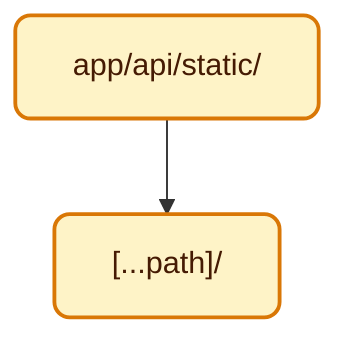

# Project Map — app/api/static

```mermaid
flowchart TB
  classDef folder fill:#fef3c7,stroke:#d97706,stroke-width:2,color:#451a03,rx:8,ry:8
  classDef file fill:#f0fdf4,stroke:#65a30d,stroke-width:1.5,color:#422006,rx:4,ry:4
  app_api_static["app/api/static/" ]
  class app_api_static folder
  app_api_static_____path_["[...path]/"]
  class app_api_static_____path_ folder
  app_api_static --> app_api_static_____path_
```
