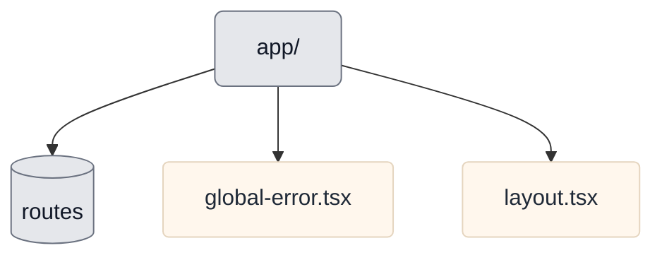

# Project Map — app/

```mermaid
graph TB
  classDef dir fill:#e5e7eb,stroke:#6b7280,color:#111827,rx:6,ry:6
  classDef file fill:#fff7ed,stroke:#e5d5bf,color:#1f2937,rx:4,ry:4
  A[app/]:::dir --> A1[(routes)]:::dir
  A --> AE[global-error.tsx]:::file
  A --> AL[layout.tsx]:::file
```
