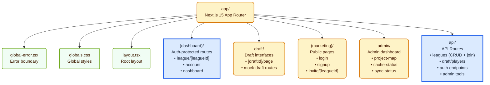

# Project Map — app

```mermaid
flowchart TB
  classDef folder fill:#fef3c7,stroke:#d97706,stroke-width:2,color:#451a03,rx:8,ry:8
  classDef file fill:#f0fdf4,stroke:#65a30d,stroke-width:1.5,color:#422006,rx:4,ry:4
  classDef highlight fill:#dbeafe,stroke:#2563eb,stroke-width:3,color:#1e293b
  
  R["app/<br/>Next.js 15 App Router"]
  class R folder
  
  %% Root files
  global_error_tsx["global-error.tsx<br/>Error boundary"]
  class global_error_tsx file
  R --> global_error_tsx
  
  globals_css["globals.css<br/>Global styles"]
  class globals_css file
  R --> globals_css
  
  layout_tsx["layout.tsx<br/>Root layout"]
  class layout_tsx file
  R --> layout_tsx
  
  %% Main route groups
  app_dashboard_["(dashboard)/<br/>Auth-protected routes<br/>• league/[leagueId]<br/>• account<br/>• dashboard"]
  class app_dashboard_ highlight
  R --> app_dashboard_
  click app_dashboard_ "/admin/project-map/app/dashboard" "Open dashboard routes"
  
  app_draft_["draft/<br/>Draft interfaces<br/>• [draftId]/page<br/>• mock-draft routes"]
  class app_draft_ folder
  R --> app_draft_
  click app_draft_ "/admin/project-map/app/draft" "Open draft routes"
  
  app_marketing_["(marketing)/<br/>Public pages<br/>• login<br/>• signup<br/>• invite/[leagueId]"]
  class app_marketing_ folder
  R --> app_marketing_
  click app_marketing_ "/admin/project-map/app/marketing" "Open marketing routes"
  
  app_admin_["admin/<br/>Admin dashboard<br/>• project-map<br/>• cache-status<br/>• sync-status"]
  class app_admin_ folder
  R --> app_admin_
  click app_admin_ "/admin/project-map/app/admin" "Open admin tools"
  
  app_api_["api/<br/>API Routes<br/>• leagues (CRUD + join)<br/>• draft/players<br/>• auth endpoints<br/>• admin tools"]
  class app_api_ highlight
  R --> app_api_
  click app_api_ "/admin/project-map/app/api" "Open API routes"
```
