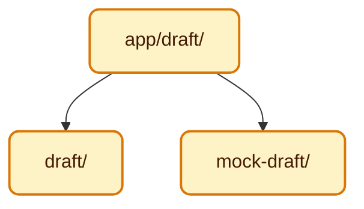

# Project Map — app/draft

```mermaid
flowchart TB
  classDef folder fill:#fef3c7,stroke:#d97706,stroke-width:2,color:#451a03,rx:8,ry:8
  classDef file fill:#f0fdf4,stroke:#65a30d,stroke-width:1.5,color:#422006,rx:4,ry:4
  app_draft["app/draft/" ]
  class app_draft folder
  app_draft_draft["draft/"]
  class app_draft_draft folder
  app_draft --> app_draft_draft
  click app_draft_draft "/admin/project-map/app/draft/draft" "Open draft"
  app_draft_mock_draft["mock-draft/"]
  class app_draft_mock_draft folder
  app_draft --> app_draft_mock_draft
  click app_draft_mock_draft "/admin/project-map/app/draft/mock-draft" "Open mock-draft"
```
