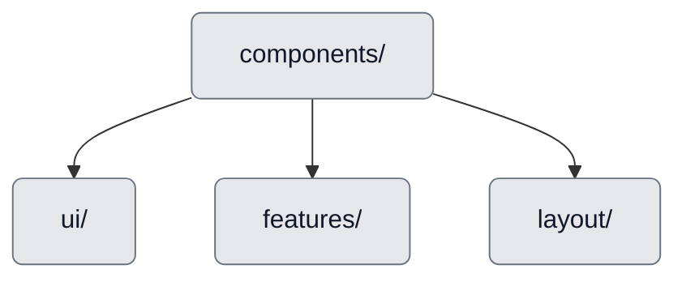

# Project Map — components/

```mermaid
graph TB
  classDef dir fill:#e5e7eb,stroke:#6b7280,color:#111827,rx:6,ry:6
  C[components/]:::dir --> C1[ui/]:::dir
  C --> C2[features/]:::dir
  C --> C3[layout/]:::dir
```
