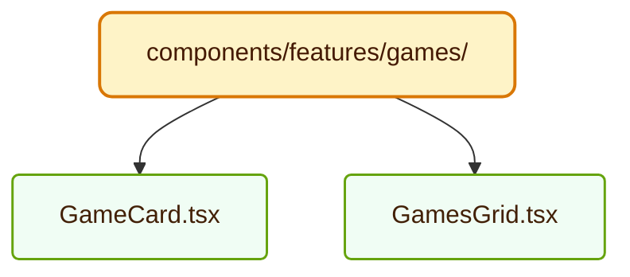

# Project Map — components/features/games

```mermaid
flowchart TB
  classDef folder fill:#fef3c7,stroke:#d97706,stroke-width:2,color:#451a03,rx:8,ry:8
  classDef file fill:#f0fdf4,stroke:#65a30d,stroke-width:1.5,color:#422006,rx:4,ry:4
  components_features_games["components/features/games/" ]
  class components_features_games folder
  components_features_games_GameCard_tsx["GameCard.tsx"]
  class components_features_games_GameCard_tsx file
  components_features_games --> components_features_games_GameCard_tsx
  components_features_games_GamesGrid_tsx["GamesGrid.tsx"]
  class components_features_games_GamesGrid_tsx file
  components_features_games --> components_features_games_GamesGrid_tsx
```
