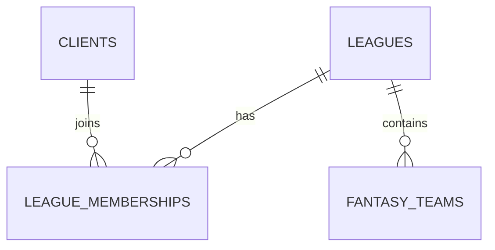

# Leagues Entity Relation

Collections:
- leagues: leagueName, season, gameMode, draftType, pickTimeSeconds, draftDate, selectedConference, phase
- league_memberships: leagueId, authUserId, role, status
- fantasy_teams: leagueId, teamName, ownerAuthUserId, draftPosition

Relationships:
- leagues (1) → (many) league_memberships
- leagues (1) → (many) fantasy_teams
- clients (1) → (many) league_memberships

Immutable after creation: gameMode, selectedConference

Related: ../overview/leagues.md

