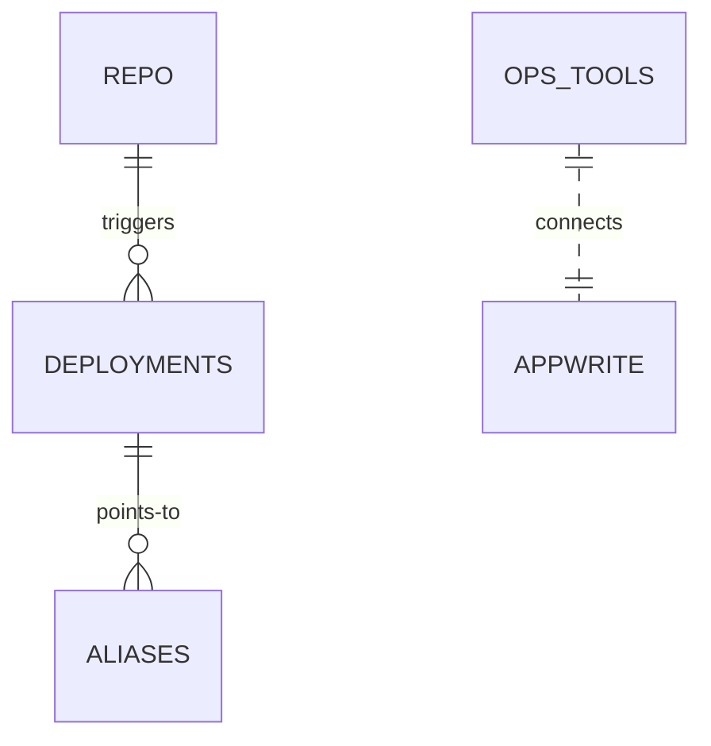

# Ops/Deploy Entity Relation

Artifacts:
- Git repo → Vercel deployment → alias
- Appwrite project (endpoint, projectId, databaseId)
- MCP config (~/.cursor/mcp.json)

Relationships:
- Code → build → deploy → monitor

Related: ../overview/ops-deploy.md

