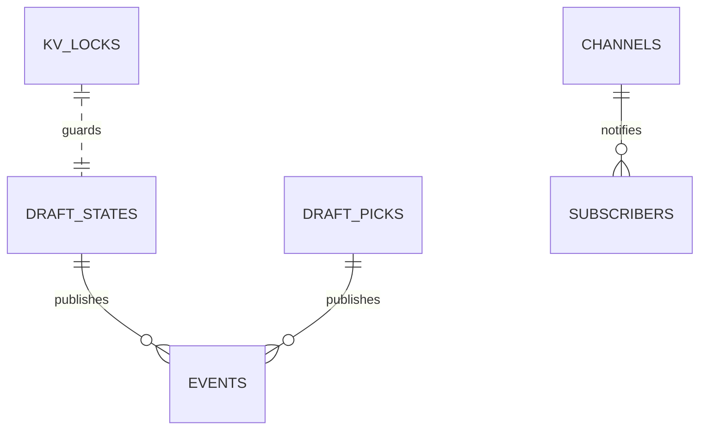

# Realtime Entity Relation

Entities:
- Appwrite Realtime channels (draft-{leagueId})
- Vercel KV locks (draft:{leagueId}:lock)
- Draft/state collections publishing events

Relationships:
- DB updates → emit events → channel subscribers receive

Related: ../overview/realtime.md

