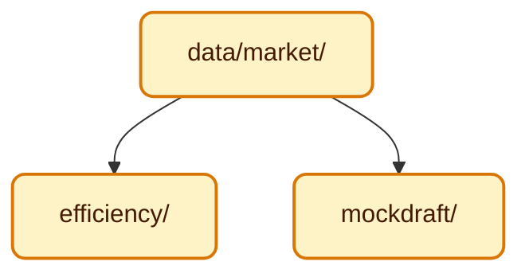

# Project Map — data/market

```mermaid
flowchart TB
  classDef folder fill:#fef3c7,stroke:#d97706,stroke-width:2,color:#451a03,rx:8,ry:8
  classDef file fill:#f0fdf4,stroke:#65a30d,stroke-width:1.5,color:#422006,rx:4,ry:4
  data_market["data/market/" ]
  class data_market folder
  data_market_efficiency["efficiency/"]
  class data_market_efficiency folder
  data_market --> data_market_efficiency
  click data_market_efficiency "/admin/project-map/data/market/efficiency" "Open efficiency"
  data_market_mockdraft["mockdraft/"]
  class data_market_mockdraft folder
  data_market --> data_market_mockdraft
  click data_market_mockdraft "/admin/project-map/data/market/mockdraft" "Open mockdraft"
```
