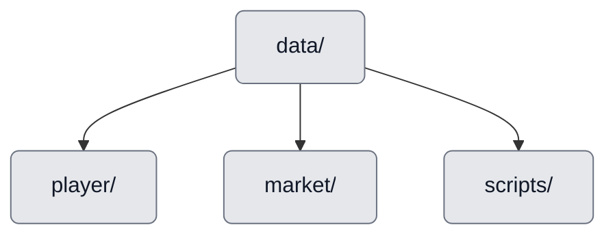

# Project Map — data/

```mermaid
graph TB
  classDef dir fill:#e5e7eb,stroke:#6b7280,color:#111827,rx:6,ry:6
  DT[data/]:::dir --> DT1[player/]:::dir
  DT --> DT2[market/]:::dir
  DT --> DT3[scripts/]:::dir
```
