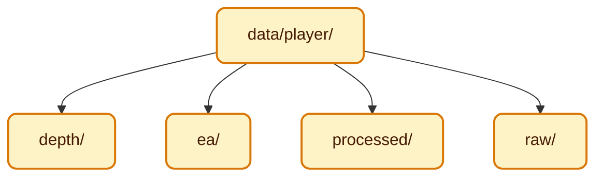

# Project Map — data/player

```mermaid
flowchart TB
  classDef folder fill:#fef3c7,stroke:#d97706,stroke-width:2,color:#451a03,rx:8,ry:8
  classDef file fill:#f0fdf4,stroke:#65a30d,stroke-width:1.5,color:#422006,rx:4,ry:4
  data_player["data/player/" ]
  class data_player folder
  data_player_depth["depth/"]
  class data_player_depth folder
  data_player --> data_player_depth
  click data_player_depth "/admin/project-map/data/player/depth" "Open depth"
  data_player_ea["ea/"]
  class data_player_ea folder
  data_player --> data_player_ea
  click data_player_ea "/admin/project-map/data/player/ea" "Open ea"
  data_player_processed["processed/"]
  class data_player_processed folder
  data_player --> data_player_processed
  click data_player_processed "/admin/project-map/data/player/processed" "Open processed"
  data_player_raw["raw/"]
  class data_player_raw folder
  data_player --> data_player_raw
  click data_player_raw "/admin/project-map/data/player/raw" "Open raw"
```
