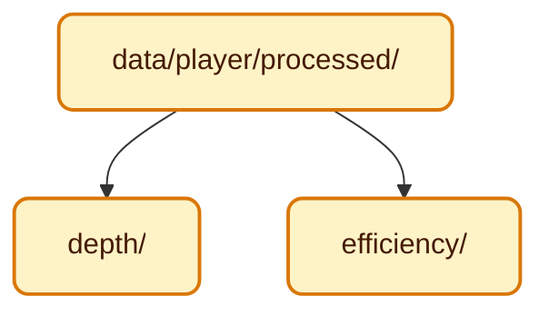

# Project Map — data/player/processed

```mermaid
flowchart TB
  classDef folder fill:#fef3c7,stroke:#d97706,stroke-width:2,color:#451a03,rx:8,ry:8
  classDef file fill:#f0fdf4,stroke:#65a30d,stroke-width:1.5,color:#422006,rx:4,ry:4
  data_player_processed["data/player/processed/" ]
  class data_player_processed folder
  data_player_processed_depth["depth/"]
  class data_player_processed_depth folder
  data_player_processed --> data_player_processed_depth
  data_player_processed_efficiency["efficiency/"]
  class data_player_processed_efficiency folder
  data_player_processed --> data_player_processed_efficiency
```
