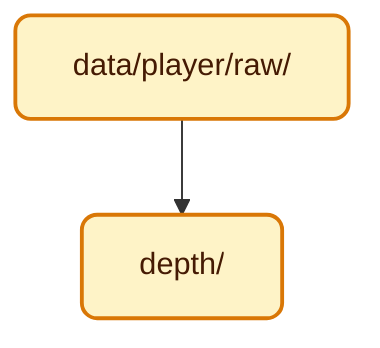

# Project Map — data/player/raw

```mermaid
flowchart TB
  classDef folder fill:#fef3c7,stroke:#d97706,stroke-width:2,color:#451a03,rx:8,ry:8
  classDef file fill:#f0fdf4,stroke:#65a30d,stroke-width:1.5,color:#422006,rx:4,ry:4
  data_player_raw["data/player/raw/" ]
  class data_player_raw folder
  data_player_raw_depth["depth/"]
  class data_player_raw_depth folder
  data_player_raw --> data_player_raw_depth
```
