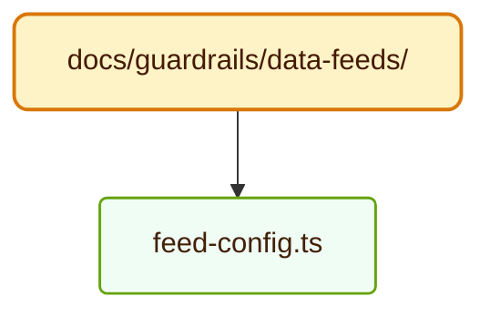

# Project Map — docs/guardrails/data-feeds

```mermaid
flowchart TB
  classDef folder fill:#fef3c7,stroke:#d97706,stroke-width:2,color:#451a03,rx:8,ry:8
  classDef file fill:#f0fdf4,stroke:#65a30d,stroke-width:1.5,color:#422006,rx:4,ry:4
  docs_guardrails_data_feeds["docs/guardrails/data-feeds/" ]
  class docs_guardrails_data_feeds folder
  docs_guardrails_data_feeds_feed_config_ts["feed-config.ts"]
  class docs_guardrails_data_feeds_feed_config_ts file
  docs_guardrails_data_feeds --> docs_guardrails_data_feeds_feed_config_ts
```
