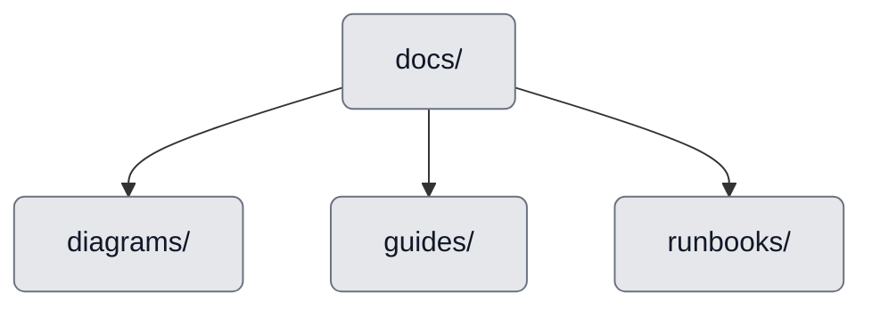

# Project Map — docs/

```mermaid
graph TB
  classDef dir fill:#e5e7eb,stroke:#6b7280,color:#111827,rx:6,ry:6
  D[docs/]:::dir --> D1[diagrams/]:::dir
  D --> D2[guides/]:::dir
  D --> D3[runbooks/]:::dir
```
