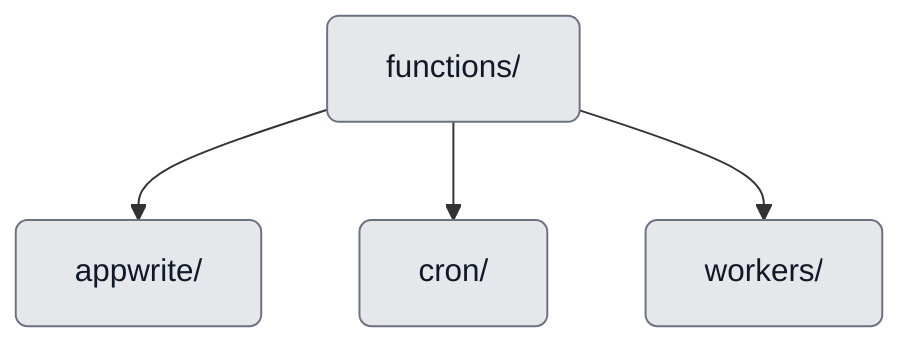

# Project Map — functions/

```mermaid
graph TB
  classDef dir fill:#e5e7eb,stroke:#6b7280,color:#111827,rx:6,ry:6
  F[functions/]:::dir --> F1[appwrite/]:::dir
  F --> F2[cron/]:::dir
  F --> F3[workers/]:::dir
```
