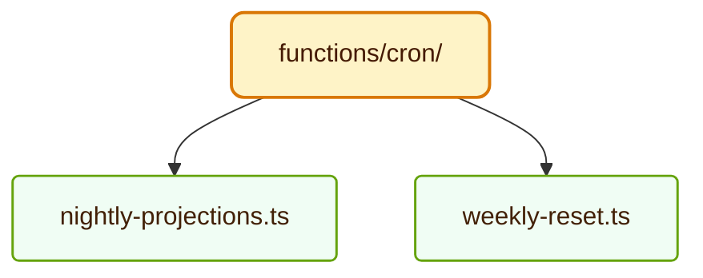

# Project Map — functions/cron

```mermaid
flowchart TB
  classDef folder fill:#fef3c7,stroke:#d97706,stroke-width:2,color:#451a03,rx:8,ry:8
  classDef file fill:#f0fdf4,stroke:#65a30d,stroke-width:1.5,color:#422006,rx:4,ry:4
  functions_cron["functions/cron/" ]
  class functions_cron folder
  functions_cron_nightly_projections_ts["nightly-projections.ts"]
  class functions_cron_nightly_projections_ts file
  functions_cron --> functions_cron_nightly_projections_ts
  functions_cron_weekly_reset_ts["weekly-reset.ts"]
  class functions_cron_weekly_reset_ts file
  functions_cron --> functions_cron_weekly_reset_ts
```
