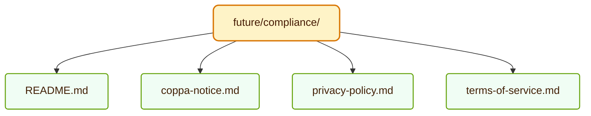

# Project Map — future/compliance

```mermaid
flowchart TB
  classDef folder fill:#fef3c7,stroke:#d97706,stroke-width:2,color:#451a03,rx:8,ry:8
  classDef file fill:#f0fdf4,stroke:#65a30d,stroke-width:1.5,color:#422006,rx:4,ry:4
  future_compliance["future/compliance/" ]
  class future_compliance folder
  future_compliance_README_md["README.md"]
  class future_compliance_README_md file
  future_compliance --> future_compliance_README_md
  future_compliance_coppa_notice_md["coppa-notice.md"]
  class future_compliance_coppa_notice_md file
  future_compliance --> future_compliance_coppa_notice_md
  future_compliance_privacy_policy_md["privacy-policy.md"]
  class future_compliance_privacy_policy_md file
  future_compliance --> future_compliance_privacy_policy_md
  future_compliance_terms_of_service_md["terms-of-service.md"]
  class future_compliance_terms_of_service_md file
  future_compliance --> future_compliance_terms_of_service_md
```
