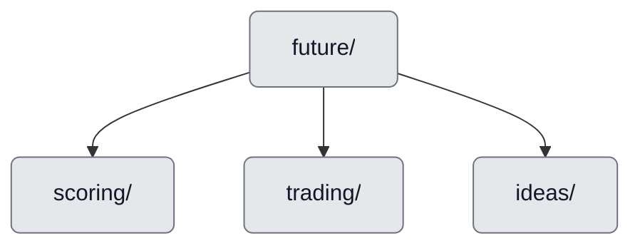

# Project Map — future/

```mermaid
graph TB
  classDef dir fill:#e5e7eb,stroke:#6b7280,color:#111827,rx:6,ry:6
  FT[future/]:::dir --> FT1[scoring/]:::dir
  FT --> FT2[trading/]:::dir
  FT --> FT3[ideas/]:::dir
```
