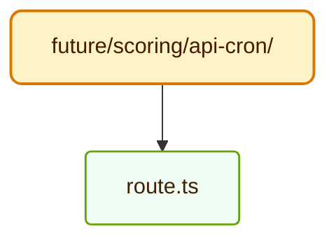

# Project Map — future/scoring/api-cron

```mermaid
flowchart TB
  classDef folder fill:#fef3c7,stroke:#d97706,stroke-width:2,color:#451a03,rx:8,ry:8
  classDef file fill:#f0fdf4,stroke:#65a30d,stroke-width:1.5,color:#422006,rx:4,ry:4
  future_scoring_api_cron["future/scoring/api-cron/" ]
  class future_scoring_api_cron folder
  future_scoring_api_cron_route_ts["route.ts"]
  class future_scoring_api_cron_route_ts file
  future_scoring_api_cron --> future_scoring_api_cron_route_ts
```
