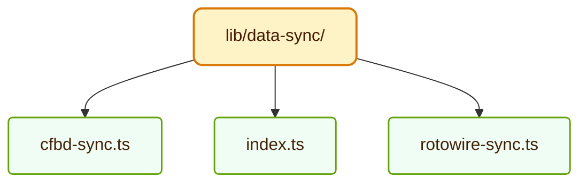

# Project Map — lib/data-sync

```mermaid
flowchart TB
  classDef folder fill:#fef3c7,stroke:#d97706,stroke-width:2,color:#451a03,rx:8,ry:8
  classDef file fill:#f0fdf4,stroke:#65a30d,stroke-width:1.5,color:#422006,rx:4,ry:4
  lib_data_sync["lib/data-sync/" ]
  class lib_data_sync folder
  lib_data_sync_cfbd_sync_ts["cfbd-sync.ts"]
  class lib_data_sync_cfbd_sync_ts file
  lib_data_sync --> lib_data_sync_cfbd_sync_ts
  lib_data_sync_index_ts["index.ts"]
  class lib_data_sync_index_ts file
  lib_data_sync --> lib_data_sync_index_ts
  lib_data_sync_rotowire_sync_ts["rotowire-sync.ts"]
  class lib_data_sync_rotowire_sync_ts file
  lib_data_sync --> lib_data_sync_rotowire_sync_ts
```
