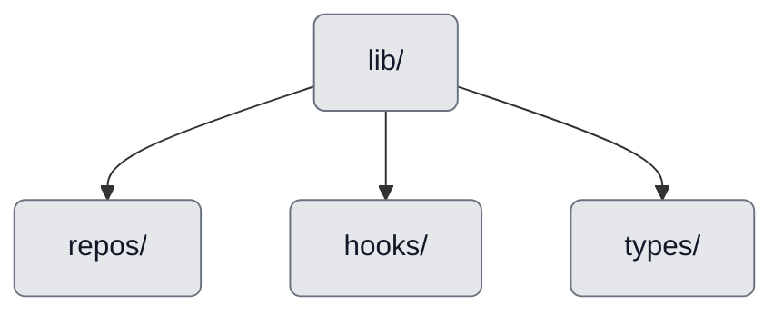

# Project Map — lib/

```mermaid
graph TB
  classDef dir fill:#e5e7eb,stroke:#6b7280,color:#111827,rx:6,ry:6
  L[lib/]:::dir --> L1[repos/]:::dir
  L --> L2[hooks/]:::dir
  L --> L3[types/]:::dir
```
