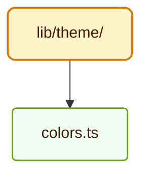

# Project Map — lib/theme

```mermaid
flowchart TB
  classDef folder fill:#fef3c7,stroke:#d97706,stroke-width:2,color:#451a03,rx:8,ry:8
  classDef file fill:#f0fdf4,stroke:#65a30d,stroke-width:1.5,color:#422006,rx:4,ry:4
  lib_theme["lib/theme/" ]
  class lib_theme folder
  lib_theme_colors_ts["colors.ts"]
  class lib_theme_colors_ts file
  lib_theme --> lib_theme_colors_ts
```
