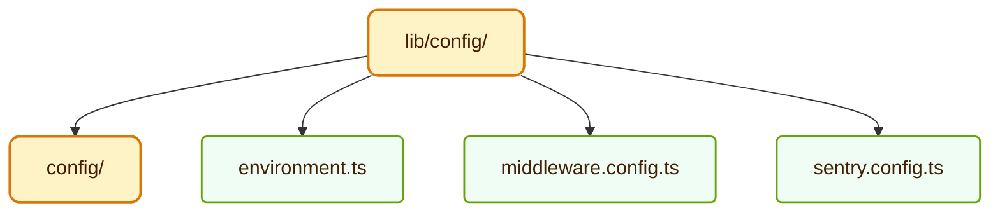

# Project Map — lib/config

```mermaid
flowchart TB
  classDef folder fill:#fef3c7,stroke:#d97706,stroke-width:2,color:#451a03,rx:8,ry:8
  classDef file fill:#f0fdf4,stroke:#65a30d,stroke-width:1.5,color:#422006,rx:4,ry:4
  lib_config["lib/config/" ]
  class lib_config folder
  lib_config_config["config/"]
  class lib_config_config folder
  lib_config --> lib_config_config
  click lib_config_config "/admin/project-map/lib/config/config" "Open config"
  lib_config_environment_ts["environment.ts"]
  class lib_config_environment_ts file
  lib_config --> lib_config_environment_ts
  lib_config_middleware_config_ts["middleware.config.ts"]
  class lib_config_middleware_config_ts file
  lib_config --> lib_config_middleware_config_ts
  lib_config_sentry_config_ts["sentry.config.ts"]
  class lib_config_sentry_config_ts file
  lib_config --> lib_config_sentry_config_ts
```
