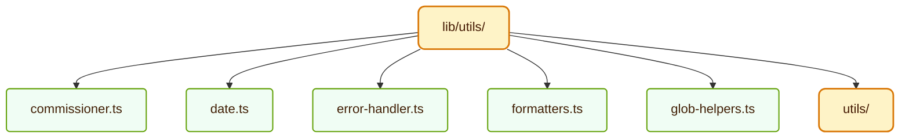

# Project Map — lib/utils

```mermaid
flowchart TB
  classDef folder fill:#fef3c7,stroke:#d97706,stroke-width:2,color:#451a03,rx:8,ry:8
  classDef file fill:#f0fdf4,stroke:#65a30d,stroke-width:1.5,color:#422006,rx:4,ry:4
  lib_utils["lib/utils/" ]
  class lib_utils folder
  lib_utils_commissioner_ts["commissioner.ts"]
  class lib_utils_commissioner_ts file
  lib_utils --> lib_utils_commissioner_ts
  lib_utils_date_ts["date.ts"]
  class lib_utils_date_ts file
  lib_utils --> lib_utils_date_ts
  lib_utils_error_handler_ts["error-handler.ts"]
  class lib_utils_error_handler_ts file
  lib_utils --> lib_utils_error_handler_ts
  lib_utils_formatters_ts["formatters.ts"]
  class lib_utils_formatters_ts file
  lib_utils --> lib_utils_formatters_ts
  lib_utils_glob_helpers_ts["glob-helpers.ts"]
  class lib_utils_glob_helpers_ts file
  lib_utils --> lib_utils_glob_helpers_ts
  lib_utils_utils["utils/"]
  class lib_utils_utils folder
  lib_utils --> lib_utils_utils
  click lib_utils_utils "/admin/project-map/lib/utils/utils" "Open utils"
```
