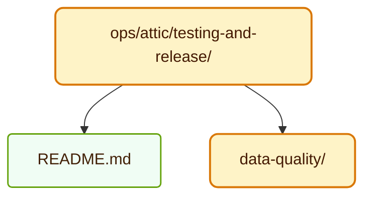

# Project Map — ops/attic/testing-and-release

```mermaid
flowchart TB
  classDef folder fill:#fef3c7,stroke:#d97706,stroke-width:2,color:#451a03,rx:8,ry:8
  classDef file fill:#f0fdf4,stroke:#65a30d,stroke-width:1.5,color:#422006,rx:4,ry:4
  ops_attic_testing_and_release["ops/attic/testing-and-release/" ]
  class ops_attic_testing_and_release folder
  ops_attic_testing_and_release_README_md["README.md"]
  class ops_attic_testing_and_release_README_md file
  ops_attic_testing_and_release --> ops_attic_testing_and_release_README_md
  ops_attic_testing_and_release_data_quality["data-quality/"]
  class ops_attic_testing_and_release_data_quality folder
  ops_attic_testing_and_release --> ops_attic_testing_and_release_data_quality
```
