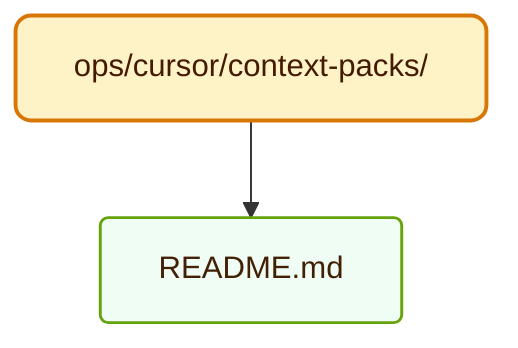

# Project Map — ops/cursor/context-packs

```mermaid
flowchart TB
  classDef folder fill:#fef3c7,stroke:#d97706,stroke-width:2,color:#451a03,rx:8,ry:8
  classDef file fill:#f0fdf4,stroke:#65a30d,stroke-width:1.5,color:#422006,rx:4,ry:4
  ops_cursor_context_packs["ops/cursor/context-packs/" ]
  class ops_cursor_context_packs folder
  ops_cursor_context_packs_README_md["README.md"]
  class ops_cursor_context_packs_README_md file
  ops_cursor_context_packs --> ops_cursor_context_packs_README_md
```
