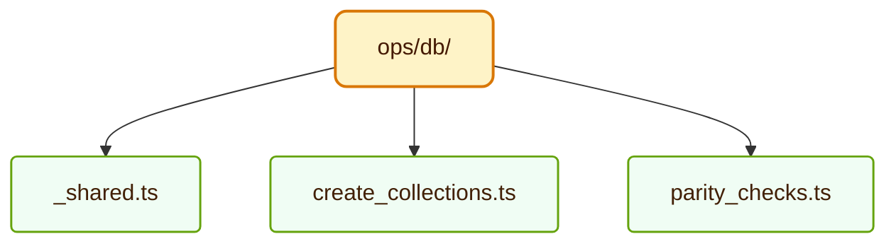

# Project Map — ops/db

```mermaid
flowchart TB
  classDef folder fill:#fef3c7,stroke:#d97706,stroke-width:2,color:#451a03,rx:8,ry:8
  classDef file fill:#f0fdf4,stroke:#65a30d,stroke-width:1.5,color:#422006,rx:4,ry:4
  ops_db["ops/db/" ]
  class ops_db folder
  ops_db__shared_ts["_shared.ts"]
  class ops_db__shared_ts file
  ops_db --> ops_db__shared_ts
  ops_db_create_collections_ts["create_collections.ts"]
  class ops_db_create_collections_ts file
  ops_db --> ops_db_create_collections_ts
  ops_db_parity_checks_ts["parity_checks.ts"]
  class ops_db_parity_checks_ts file
  ops_db --> ops_db_parity_checks_ts
```
