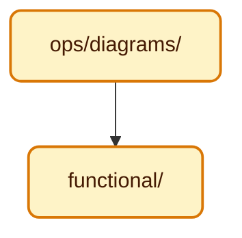

# Project Map — ops/diagrams

```mermaid
flowchart TB
  classDef folder fill:#fef3c7,stroke:#d97706,stroke-width:2,color:#451a03,rx:8,ry:8
  classDef file fill:#f0fdf4,stroke:#65a30d,stroke-width:1.5,color:#422006,rx:4,ry:4
  ops_diagrams["ops/diagrams/" ]
  class ops_diagrams folder
  ops_diagrams_functional["functional/"]
  class ops_diagrams_functional folder
  ops_diagrams --> ops_diagrams_functional
  click ops_diagrams_functional "/admin/project-map/ops/diagrams/functional" "Open functional"
```
