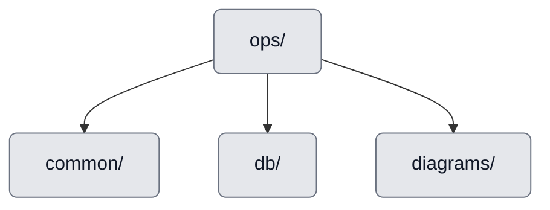

# Project Map — ops/

```mermaid
graph TB
  classDef dir fill:#e5e7eb,stroke:#6b7280,color:#111827,rx:6,ry:6
  O[ops/]:::dir --> O1[common/]:::dir
  O --> O2[db/]:::dir
  O --> O3[diagrams/]:::dir
```
