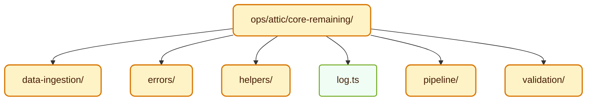

# Project Map — ops/attic/core-remaining

```mermaid
flowchart TB
  classDef folder fill:#fef3c7,stroke:#d97706,stroke-width:2,color:#451a03,rx:8,ry:8
  classDef file fill:#f0fdf4,stroke:#65a30d,stroke-width:1.5,color:#422006,rx:4,ry:4
  ops_attic_core_remaining["ops/attic/core-remaining/" ]
  class ops_attic_core_remaining folder
  ops_attic_core_remaining_data_ingestion["data-ingestion/"]
  class ops_attic_core_remaining_data_ingestion folder
  ops_attic_core_remaining --> ops_attic_core_remaining_data_ingestion
  ops_attic_core_remaining_errors["errors/"]
  class ops_attic_core_remaining_errors folder
  ops_attic_core_remaining --> ops_attic_core_remaining_errors
  ops_attic_core_remaining_helpers["helpers/"]
  class ops_attic_core_remaining_helpers folder
  ops_attic_core_remaining --> ops_attic_core_remaining_helpers
  ops_attic_core_remaining_log_ts["log.ts"]
  class ops_attic_core_remaining_log_ts file
  ops_attic_core_remaining --> ops_attic_core_remaining_log_ts
  ops_attic_core_remaining_pipeline["pipeline/"]
  class ops_attic_core_remaining_pipeline folder
  ops_attic_core_remaining --> ops_attic_core_remaining_pipeline
  ops_attic_core_remaining_validation["validation/"]
  class ops_attic_core_remaining_validation folder
  ops_attic_core_remaining --> ops_attic_core_remaining_validation
```
