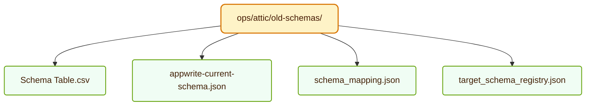

# Project Map — ops/attic/old-schemas

```mermaid
flowchart TB
  classDef folder fill:#fef3c7,stroke:#d97706,stroke-width:2,color:#451a03,rx:8,ry:8
  classDef file fill:#f0fdf4,stroke:#65a30d,stroke-width:1.5,color:#422006,rx:4,ry:4
  ops_attic_old_schemas["ops/attic/old-schemas/" ]
  class ops_attic_old_schemas folder
  ops_attic_old_schemas_Schema_Table_csv["Schema Table.csv"]
  class ops_attic_old_schemas_Schema_Table_csv file
  ops_attic_old_schemas --> ops_attic_old_schemas_Schema_Table_csv
  ops_attic_old_schemas_appwrite_current_schema_json["appwrite-current-schema.json"]
  class ops_attic_old_schemas_appwrite_current_schema_json file
  ops_attic_old_schemas --> ops_attic_old_schemas_appwrite_current_schema_json
  ops_attic_old_schemas_schema_mapping_json["schema_mapping.json"]
  class ops_attic_old_schemas_schema_mapping_json file
  ops_attic_old_schemas --> ops_attic_old_schemas_schema_mapping_json
  ops_attic_old_schemas_target_schema_registry_json["target_schema_registry.json"]
  class ops_attic_old_schemas_target_schema_registry_json file
  ops_attic_old_schemas --> ops_attic_old_schemas_target_schema_registry_json
```
