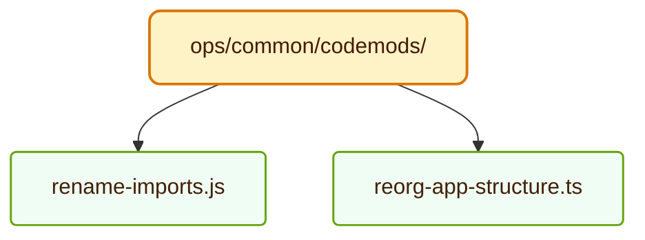

# Project Map — ops/common/codemods

```mermaid
flowchart TB
  classDef folder fill:#fef3c7,stroke:#d97706,stroke-width:2,color:#451a03,rx:8,ry:8
  classDef file fill:#f0fdf4,stroke:#65a30d,stroke-width:1.5,color:#422006,rx:4,ry:4
  ops_common_codemods["ops/common/codemods/" ]
  class ops_common_codemods folder
  ops_common_codemods_rename_imports_js["rename-imports.js"]
  class ops_common_codemods_rename_imports_js file
  ops_common_codemods --> ops_common_codemods_rename_imports_js
  ops_common_codemods_reorg_app_structure_ts["reorg-app-structure.ts"]
  class ops_common_codemods_reorg_app_structure_ts file
  ops_common_codemods --> ops_common_codemods_reorg_app_structure_ts
```
