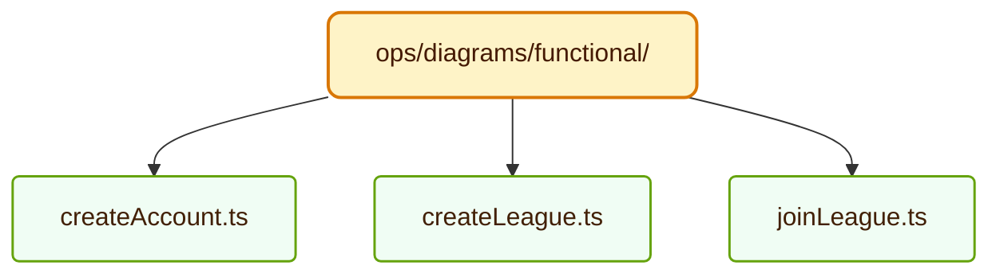

# Project Map — ops/diagrams/functional

```mermaid
flowchart TB
  classDef folder fill:#fef3c7,stroke:#d97706,stroke-width:2,color:#451a03,rx:8,ry:8
  classDef file fill:#f0fdf4,stroke:#65a30d,stroke-width:1.5,color:#422006,rx:4,ry:4
  ops_diagrams_functional["ops/diagrams/functional/" ]
  class ops_diagrams_functional folder
  ops_diagrams_functional_createAccount_ts["createAccount.ts"]
  class ops_diagrams_functional_createAccount_ts file
  ops_diagrams_functional --> ops_diagrams_functional_createAccount_ts
  ops_diagrams_functional_createLeague_ts["createLeague.ts"]
  class ops_diagrams_functional_createLeague_ts file
  ops_diagrams_functional --> ops_diagrams_functional_createLeague_ts
  ops_diagrams_functional_joinLeague_ts["joinLeague.ts"]
  class ops_diagrams_functional_joinLeague_ts file
  ops_diagrams_functional --> ops_diagrams_functional_joinLeague_ts
```
